# SimpleTodo
# 项目简介

Slides 是一个静态网站构建工具，它通过提供预设计的模板和强大的内置模块，简化了网站创建过程。它非常适合希望快速搭建网站但缺乏专业开发技能的用户。无论是个人博客、商业网站还是作品集展示，Slides 都能帮助用户轻松实现他们的目标。本项目是slides的四个免费的静态网页模板，小组成员着重对四个模板的功能进行分析。

## ✨ 项目特点

- 易于使用：Slides 提供直观的用户界面，无需编程知识即可构建网站。
- 响应式设计：所有模板均为响应式，适配手机、平板和桌面设备。
- 信息集成：支持集成聊天、讨论、邮件收集等功能，提升网站互动性。
- 模块丰富：提供排版、背景音乐、弹出窗口、用户界面元素等模块，便于定制。
- 开发者友好：基于 HTML、CSS 和 JS，代码易于理解和修改，适合开发者。
- SEO 优化：增强搜索引擎可见性，助力网站排名提升。
- 多页支持：支持创建多页网站，满足复杂需求。

## 🚀 快速开始
### 克隆项目

1.打开命令行提示符（Windows 可以用cmd/Terminal/Powershell，Mac 直接用终端）
先在D盘创建新文件
cd D:\github

2.输入命令，复制地址，克隆到自己的仓库：
git clone https://github.com/wenxiao1234/html-website-templates.git


### 安装依赖
slides
根据项目需求，使用合适的 IDE（如 Visual Studio Code 或 IntelliJ IDEA）打开项目并安装依赖项。
如果项目使用 npm，可以运行：npm install

### 启动项目
1.把克隆好的项目在Visual Studio Code中打开，可以清晰地查看文档结构和相应代码
2.如需看具体网页效果，可直接双击index.html（此网页模板由slides生成，需借助此外网网站资源，国内访问需使用加速器）
3.在浏览器中打开生成的文件，查看项目效果
项目将运行在:
`file:///D:/github/html-website-templates/Animated%20Landing%20Page%20Website%20Template/index.html`
`file:///D:/github/html-website-templates/Horizontal%20Scroll%20One%20Page%20Template%20Website/index.html`
`file:///D:/github/html-website-templates/One%20Page%20Portfolio%20Website%20Template/index.html`


## 📦 项目结构  

<!--李贵成编写-->
```
Animated Landing Page Website Template/  #动画登陆页面网站模板
├── assets/               # 图片资源
│   ├── img/              # 图片库
│       ├── background/    # 背景图片库
│           ├── img-09.jpg
│           ├── img-14.jpg
│           ├── img-15.jpg
│           ├── img-85.jpg
│           ├── img-89.jpg
│           └── img-95.jpg
│       ├── appstore.jpg    # 苹果软件商店图片
│       ├── googleplay.jpg  # 谷歌应用商店图片
│       ├── image-100.png
│       ├── image-89-1.jpg
│       └── image-89-2.jpg
│   ├── svg/                # 指向性图标库
│       ├── icons.svg       #底片
│       ├── play.svg        #播放按钮
│       ├── video-icon-dark.svg     #黑底播放图标
│       └── video-icon.svg          #白底播放图标    
├── css/
│   ├── slides.css        # 确保网页的正常功能和显示效果。 
│   ├── slides.min.css    # 采用嵌套结构，定义网页元素样式。
│   └── swiper.min.css    # Swiper轮播组件，定义相关样式，支持不同效果与不同设备的适配
├── js/                   # 脚本文件夹
│   ├── plugins.js        # 前端开发插件集合，用于增强网页交互性和改善用户体验
│   ├── slides.js         # 幻灯片展示脚本，用于创建动态、响应式的网页幻灯片展示
│   ├── slides.min.js     # 网页幻灯片展示库
│   ├── soundcloud.min.js   # 背景音乐播放脚本
│   └── swiper.min.js     # 丰富幻灯片展示的插件脚本              
├── manual/               # 提供详细说明和指导的文档
│   └── manual.url        # 快速访问对应的网页，不用手动输入网址
├── scss/                 # 基于 CSS 的预处理器文件
│   ├── colors.scss       # 定义各种颜色
│   ├── dialog.scss       # 对话框
│   ├── flex.scss         # 网页工具
│   ├── framework.scss    # 框架
│   ├── grid.scss         # 网格
│   ├── layout.scss       # 布局
│   ├── mixins.scss       # 开发者工具集
│   ├── plumber.scss      # 排版工具
│   ├── reset.scss        # 重置
│   ├── slides.scss       # 幻灯片
│   ├── typography.scss   # 排版
│   ├── useful-classes.scss     # 网页设计的各种功能
│   └── variables.scss    # 变量 
│                
├── _first-steps.url       # 首页网页链接快捷方式
├── _open-generator.url    # app快捷方式
├── ajax-email.php         # 验证邮箱
├── index.html             # 主界面
└── readme first.txt       # 声明其创建来源为指定的网页
```
```
Horizontal Scroll One Page Template Website/  # 水平滚动单页模板网站
├── assets/             # 图片资源
│   ├── img/              # 图片库
│       ├── background/    # 背景图片库
│           ├── img-26.jpg
│           ├── img-27.jpg
│           ├── img-34.jpg
│           ├── img-60.jpg
│           ├── img-83.jpg
│           ├── img-91.jpg
│           └── img-95.jpg 
│       ├── appstore.jpg
│       ├── gallery-60-1.jpg
│       ├── gallery-60-2.jpg
│       ├── gallery-60-3.jpg
│       ├── googleplay.jpg
│       ├── icon-1.png
│       ├── icon-2.png
│       ├── iphones-34.png
│       ├── watch-26-1.png
│       └── watch-26-2.png
│   ├── svg/                         # 图标库
│       ├── icons.svg                # 底片
│       ├── video-icon-dark.svg      # 黑底播放图标
│       └── video-icon.svg           # 白底播放图标   
├── css/
│   ├── slides.css        # 统一网页风格，布局和交互效果。 
│   ├── slides.min.css    # 样式表,提供一套完整的幻灯片展示解决方案
├── js/                 # 各类脚本文件夹
│   ├── plugins.js        # 前端开发插件集合，用于增强网页交互性和改善用户体验
│   ├── slides.js         # 幻灯片展示脚本，用于创建动态、响应式的网页幻灯片展示
│   ├── slides.min.js     # 网页幻灯片展示库
│   └── swiper.min.js     # 丰富幻灯片展示的插件脚本
├── manual/               # 提供详细说明和指导的文档
│   └── manual.url        # 快速访问对应的网页，不用手动输入网址
├── scss/                 # 基于 CSS 的预处理器文件
│   ├── colors.scss       # 定义各种颜色
│   ├── dialog.scss       # 对话框
│   ├── flex.scss         # 网页工具
│   ├── framework.scss    # 框架
│   ├── grid.scss         # 网格
│   ├── layout.scss       # 布局
│   ├── mixins.scss       # 开发者工具集
│   ├── plumber.scss      # 排版工具
│   ├── reset.scss        # 重置
│   ├── slides.scss       # 幻灯片
│   ├── typography.scss   # 排版
│   ├── useful-classes.scss     # 网页设计的各种功能
│   └── variables.scss    # 变量 
│                
├── _first-steps.url       # 首页网页链接快捷方式
├── _open-generator.url    # app快捷方式
├── ajax-email.php         # 验证邮箱
├── index.html             # 主界面
└── readme first.txt       # 声明其创建来源为指定的网页
```


## 📮 项目主要功能说明与截图
<!--文晓编写-->
一、Animated Landing Page Website Template 
这是一个动画登录页面网站模板，由6个页面组成，侧边栏可以选择要切换到页面。页面布局美观合理。
第一个页面是登录页面，填写好表单可以开始使用，中间有视频教程
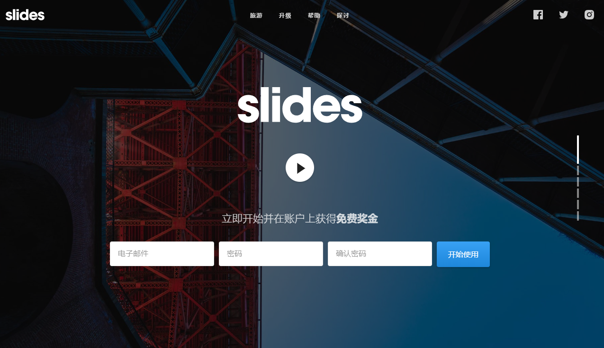
第二、三个页面属于介绍页面，引导人使用其项目
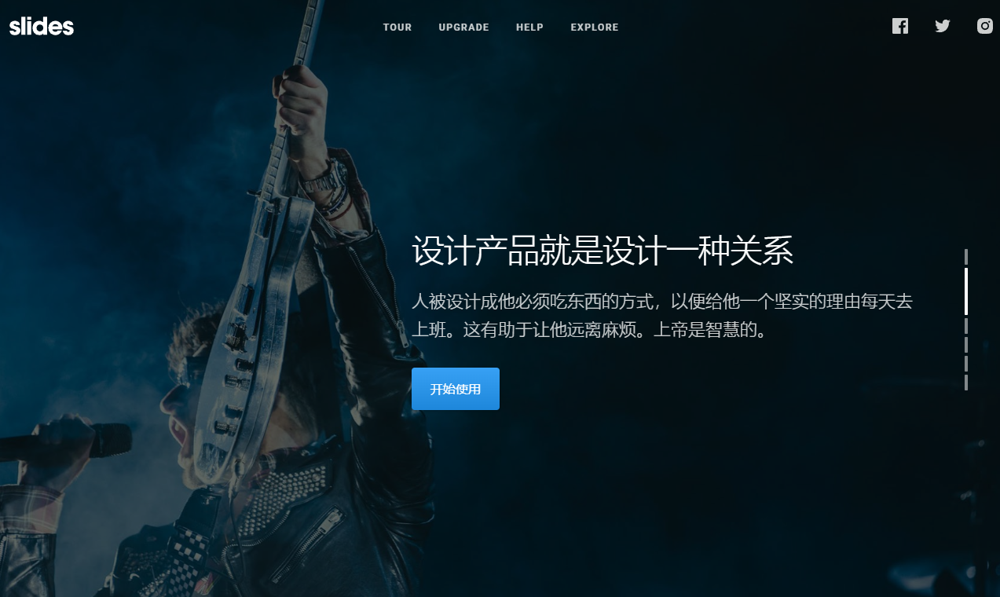
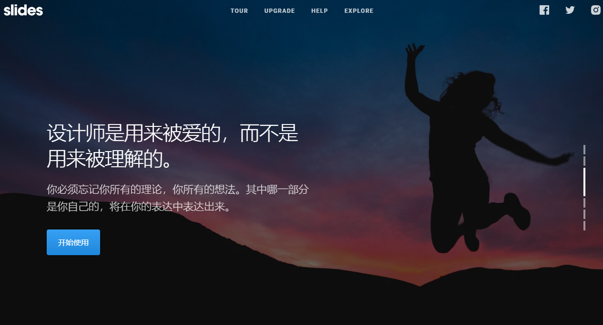
第四个页面用来介绍产品，图和视频都能点击查看详情
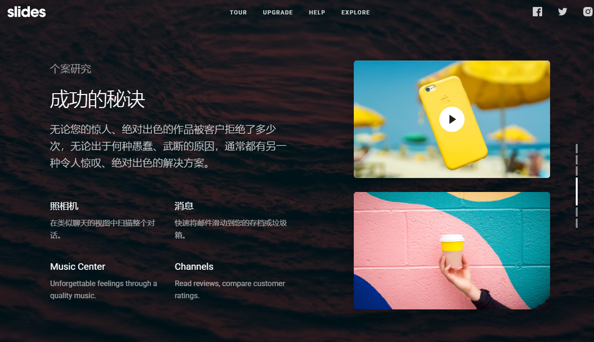
第五、六个页面是引导用户试用

二、Horizontal Scroll One Page Template Website
这是一个水平滚动单页网站网站，此网页由7个滚动页面构成，当鼠标下滑时可以向右滚动切换页面。整体界面切换比较流畅，页面切换衔接舒适。
第一个页面点击手表时可使图片聚焦在页面中心
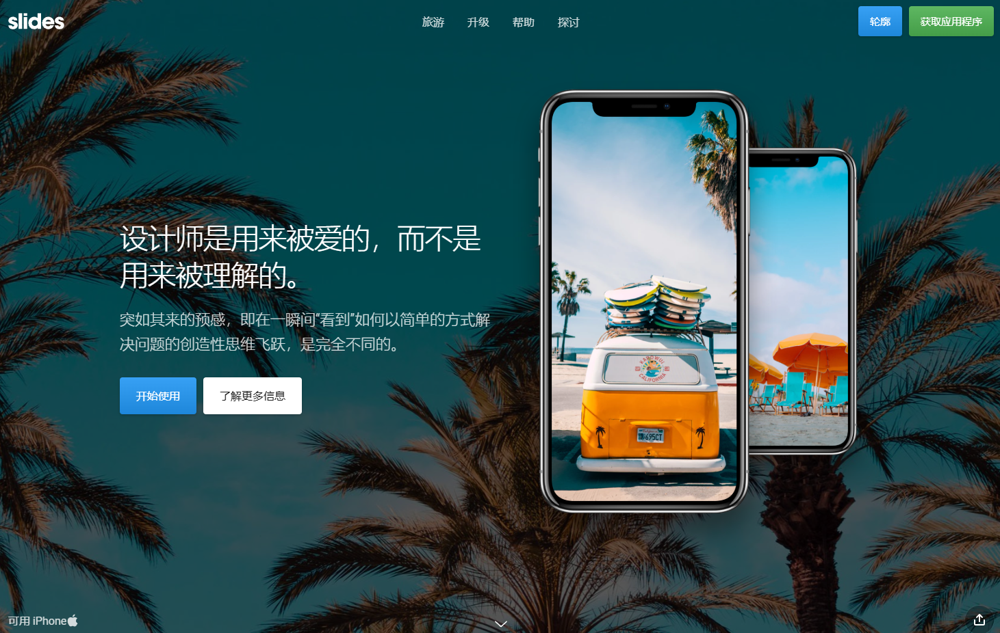
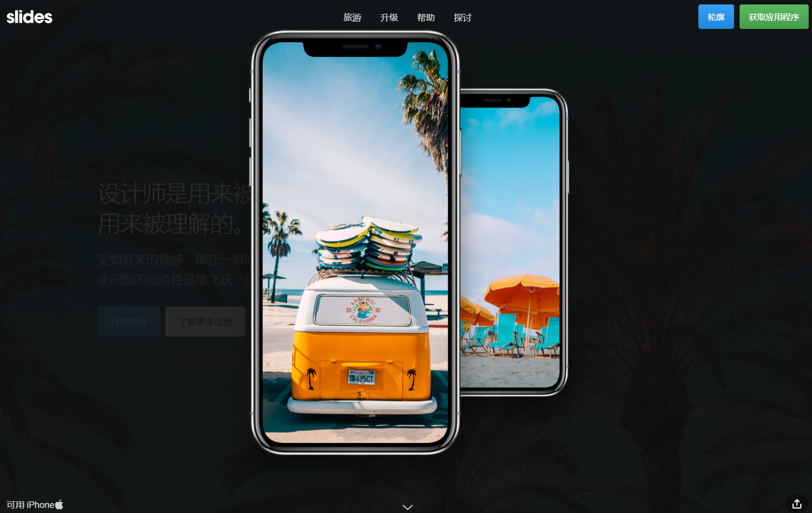
第二个页面点击视频课播放
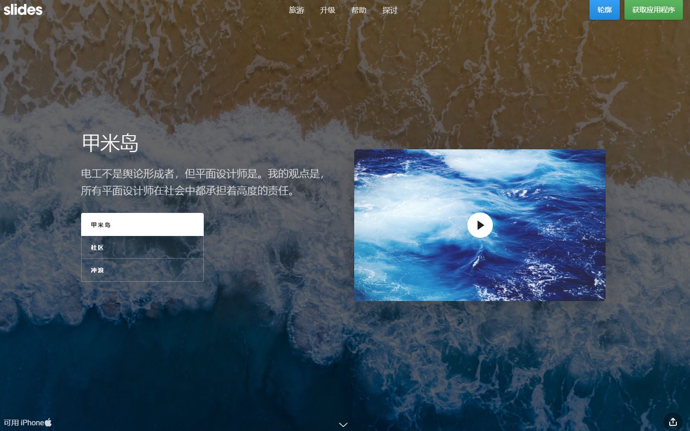
第三、四个页面点击手表图片可切换不同样式的手表图片
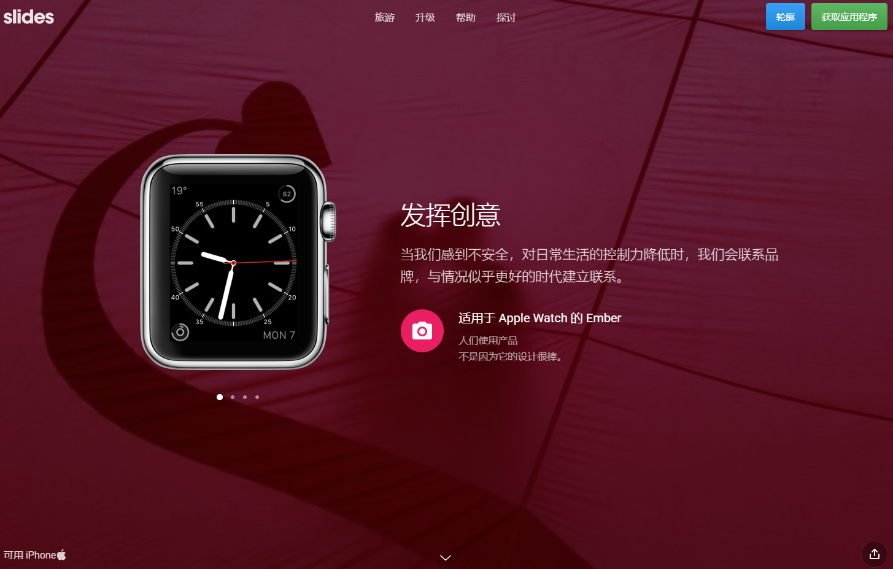
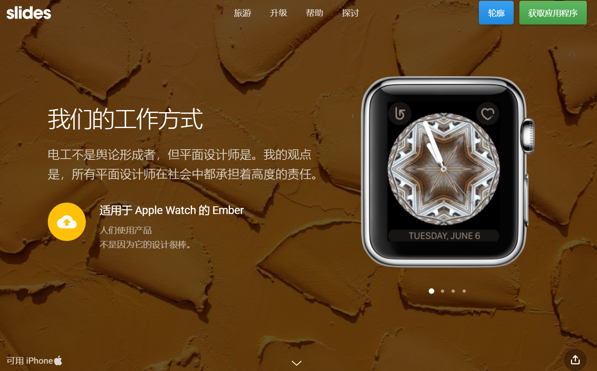
第五个页面点击“购买”会跳转到第一个页面
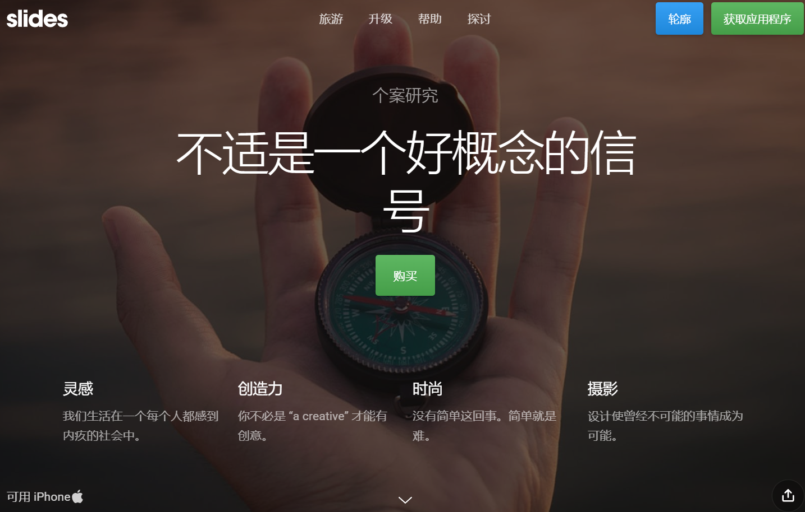
第六、七个页面是引导用户试用

三.Landing Page Website for App
 这是为移动应用（App）专门设计的着陆页网站。此网页由7个滚动页面构成， 整体界面自适应屏幕大小，界面用户友好性强。
 1.第一个页面有个手机图片，单击可切换图片
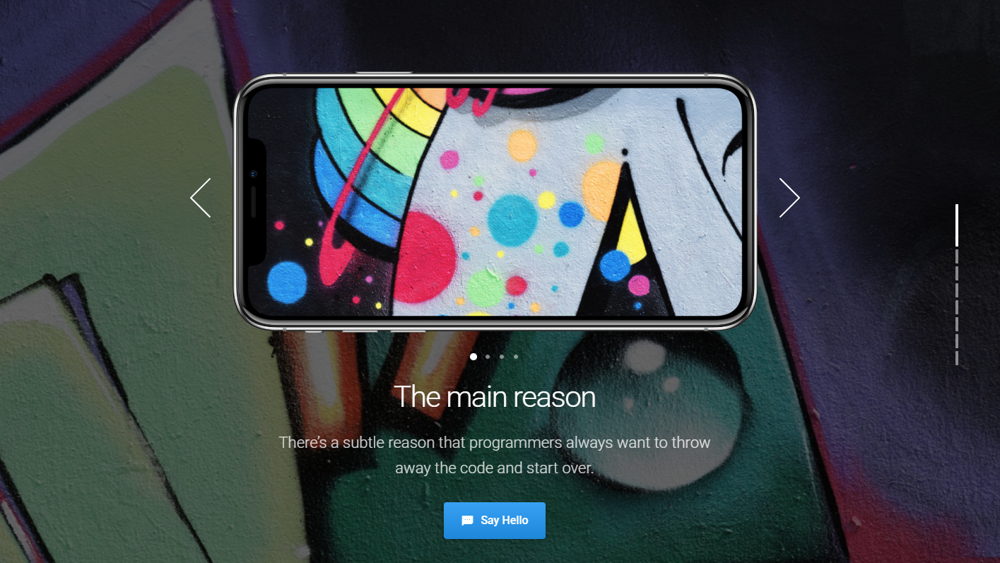
 2.第二个页面有7张图片，单击可查看大图，下方三个模块默认跳转到第一页
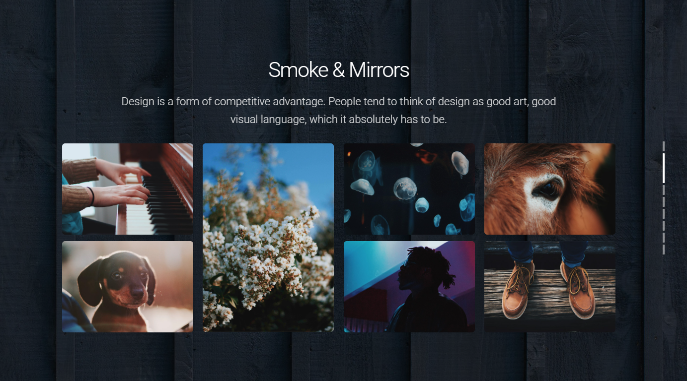
 3.第三个页面是介绍页，单击手机图片可查看大图
 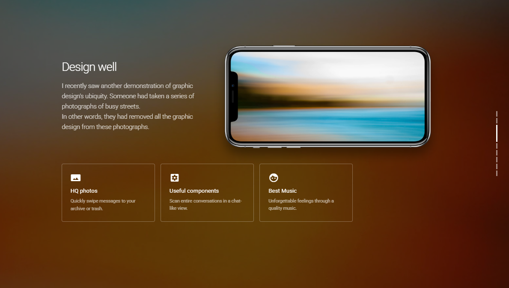
 4.其余页面为引导用户试用

四.One Page Portfolio Website Template
这是一个专门设计用于展示个人或公司作品、技能、服务和联系方式等信息的网站模板。整体页面布局合理，图文并茂，介绍详略得当，界面美观。
1.第一个页面以标题和文字为主。

2.第二个页面和第三个模板一样分为7个图片，单击可查看大图
3.第三个页面是视频、图片与文本结合，布局美观大气
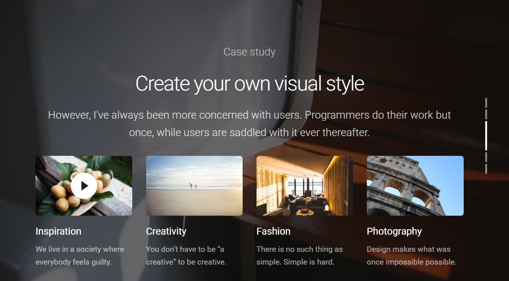
4.第四个页面是更详细的图文介绍页面，配图美观，单击图片默认跳转第一页
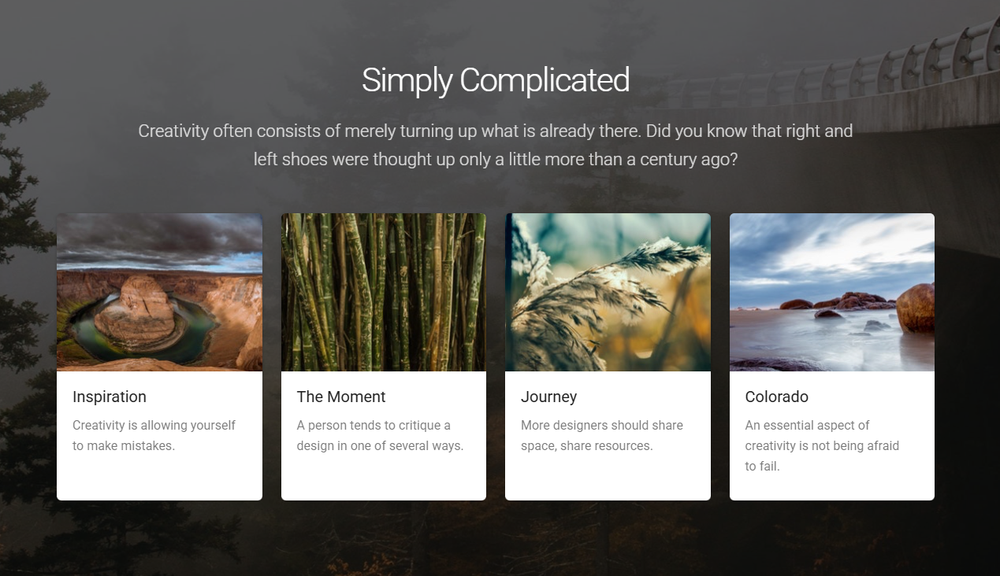
5.第五张网页有部分文本，有着工作室的联系方式。
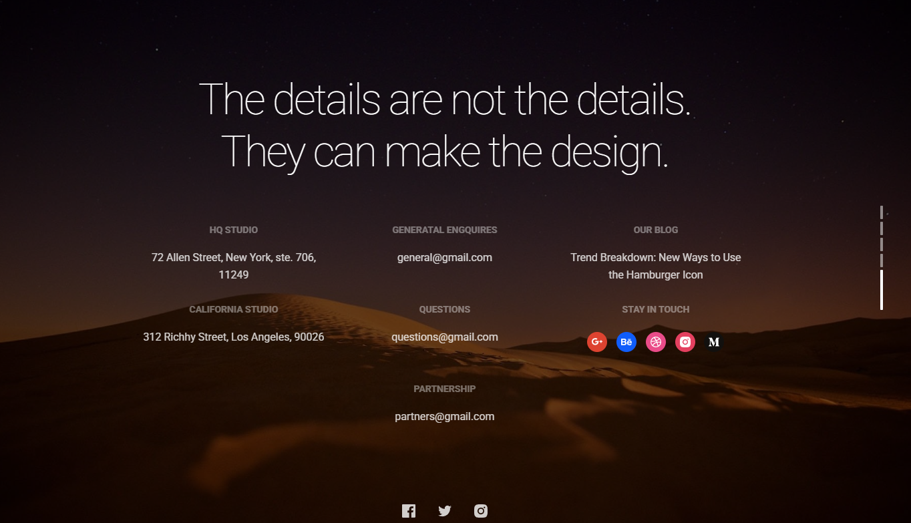

